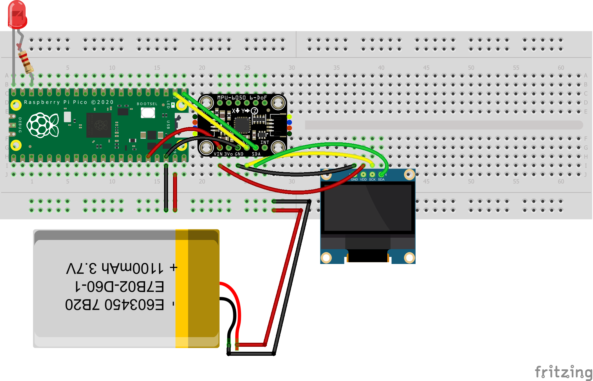

# Engineering_4_Notebook

&nbsp;

## Table of Contents
* [Led Blink](#led_blink)
* [Countdown](#countdown)
* [Countdown 2](#countdown-2)
* [Countdown 3](#countdown-3)
* [Countdown 4](#countdown-4)
* [Crash Avoidance Part 1](#Crash-Avoidance-Part-1)
* [Crash Avoidance Part 2](#Crash-Avoidance-Part-2)
* [Crash Avoidance Part 3](#Crash-Avoidance-Part-3)
* [Beam design part 1](#beam-part-1)
* [FEA Analysis](#fea-analysis)
* [FEA Iterative design](#fea-iterative-design)
* [Landing area Part 1](#landing-area-part-1)
* [Landing area Part 2](#landing-area-part-2)
* [Morse code 1](#morse-code-1)
* [Morse code 2](#morse-code-2)
* [Data 1](#data-1)
* [Data 2](#data-2)


## Led Blink

### Assignment Description
This Assignment was a part of the pico introduction. It was a simple assignment to get us used to the Raspberry Pi and the Python language. The assignment was to make an LED blink on and off.

### Evidence


### Code
```python
import time 
import board # type: ignore
import digitalio # type: ignore

led = digitalio.DigitalInOut(board.LED)
led.direction = digitalio.Direction.OUTPUT


while True:
    led.value = True
    time.sleep(0.5)
    led.value = False
    time.sleep(0.5) 
```

### Reflection 
This assignment was very simple and easy to do and in my opinion was basicaly a settup test for VS code. I had no problems with this assignment and it was a good way to get used to the Raspberry Pi and the Python language. 

## Countdown

### Assignment Description
In this assignment we where tasked with making a countdown timer, counting down from 10 to 0, with a interval of 1 second.

### Evidence


### Code
```python
import time

for x in range(10):
    print(10-x)
    time.sleep(1)
print("Blast Off!")
```

### Reflection
This assignment was again very easy and simple. I had no problems and all i did was use a for loop to countdown. I also used the time.sleep() function to make the program wait for 1 second before printing the next number. It was a good way to refresh on the python syntax.

---

## Countdown 2 


### Assignment Description
In this assignment we where tasked with creating a countdowntime but one that signaled the countdown with an LED. The LED would blink once every second and when the countdown reached 0 another LED would turn on.

### Evidence

### Code
```python
RedLED = digitalio.DigitalInOut(board.GP19)
BlueLED = digitalio.DigitalInOut(board.GP13)
# INNITS 


for x in [RedLED, BlueLED]:
    x.direction = digitalio.Direction.OUTPUT

    
for x in range(10): # make led blink 10 times to represent countdown
    BlueLED.value = True
    time.sleep(.25)
    BlueLED.value = False
    time.sleep(.25)
    
RedLED.value = True
time.sleep(10) # wait 10 seconds with red LED on
RedLED.value = False
```

## Video


https://github.com/Pweder69/Engineering_4_Notebook/assets/112962227/4ddb7952-9454-4dd3-ae60-19218dd3f250

### Reflection
This assignment was a bit harder but really still very easy. All i had to do is just run a basic for loop that runs the turn led off and then on again 10 times. Then i just had to turn the red led on for 10 seconds. There were no major design choices as this is practically just controlling 2 leds i doubught that two people could come up with a drasticaly diffrent solution for this problem.

---

## Countdown 3
 
### Assignment Description
I did the "spicy" version of this assignment this entailed me to make a system that "aborted" the launch on the second button press. This would then reset the countdown to the original state of waiting for the first button press.


### Evidence


<details>

<summary> CODE</summary>

```python
RedLED = digitalio.DigitalInOut(board.GP19)
BlueLED = digitalio.DigitalInOut(board.GP13)
Button = digitalio.DigitalInOut(board.GP20)

Button.direction = digitalio.Direction.INPUT
Button.pull = digitalio.Pull.UP


for x in [RedLED, BlueLED]:
    x.direction = digitalio.Direction.OUTPUT
    
    
oldval = False


def delayCheck(waitTime):
    global Button,oldval

    
    # print(Button.value, oldval) #DEBUG
    time1 = time.time()
    
    # operates like a sleep but checks for button press and aborts if pressed
    
    
    while time.time() - time1 < waitTime:
        # print(oldval, Button.value) #DEBUG
        if Button.value == False and oldval:
            print("Aborted")
            RedLED.value = False
            BlueLED.value = False
            oldval = True
            # if pressed recursivly call countdown to start the loop in the loop
            countdown()
            
        
        oldval = Button.value
        
    
    
    
def countdown():
    global RedLED, BlueLED, Button,oldval
    
    
    
    while True:
        if Button.value == False and oldval: # false means pressed
            # print(Button.value, oldval) #DEBUG
            
            oldval = False
            
            for x in range(5):

                RedLED.value = True
                delayCheck(1)
                RedLED.value = False
                delayCheck(1)
            
            #
            #DOESNT MATTER For recusion
            #    
            
            BlueLED.value = True
            time.sleep(2.5)
            BlueLED.value = False
        oldval = Button.value
countdown()
```

</details>

#### Video

https://github.com/Pweder69/Engineering_4_Notebook/assets/112962227/c163b2c7-e478-47ed-bc55-8aa9de551932


#### Wiring


### Reflection
This assignments was by far the hardest specificaly becasue of the spicy. The solution for me was to use recursion to call the loop again on "abort" this was not the hard part as encapsulating was relativly easy. The hardest part by far was getting the debounce loop correct as you have to make sure the debounce enters the loop without imediatly aborting and then after still updating the button and also debouncing abort so it wouldnt infinity loop to crash the whole thing.


---

## Countdown 4 

### Assignment Description
In this assignment we were tasked with creating a countodwn similiarly as last time using a button to start. This time we had to incorporate a servo into the mix. The servo would start at 0 degrees and then move to 180 degrees over the course of the last 3 seconds of the countdown.


### Evidence


#### Video


https://github.com/Pweder69/Engineering_4_Notebook/assets/112962227/b9baa222-bc16-4262-962b-d77aec0a1b0b


#### Wiring


#### Code

https://github.com/Pweder69/Engineering_4_Notebook/blob/fc1bf041284bd25b0e908ca2471cf235cd8136b1/raspberry-pi/Countdown4.py

### Reflection

This assignmnet was fun and easy to do as the problem was inivative i thought my solution was good although to complicated and looping over a set of degrees instead of time was overcomplicated. It also was good becaue it allowed me to learn how to use a servo again and all the intricacy of the servo library.

---

## Crash Avoidance Part 1

### Assignment Description
We were tasked with adding a **mpu6050(Accelerometer)** to our board and then printing out the values that it gave us rounded to the third decimal place.

### Evidence

#### Video


#### Wiring


<details open>
<summary>Code</summary>
<br>

```python
sda_pin = board.GP14
scl_pin = board.GP15

i2c = busio.I2C(scl_pin, sda_pin)   

mpu = adafruit_mpu6050.MPU6050(i2c)

while True:
    acc = mpu.acceleration
    
    added = [] # created added so i dont have to change the format everytime i want to print
    for x in acc: # loops over acc tuple rounds the value and stores it in a new list.
        added.append(round(x,3)) # rounds to 3 decimal places
        
    print(f"x:{added[0]} y:{added[1]} z:{added[2]}") # prints the values labeled with x y and z.
```
</details>

### Reflection 
This assignment was nice way to get intoduced to more complex components as i have never used a board like this before. The one design choice made was to loop over the tuple and round each value into a new list. That solution is typicaly used for larger data but i did it becasue it would allow me to easily effect the format of the print statement without having to change every print statment if i were to print every value individualy.

---
## Crash Avoidance Part 2

### Assignment Description
In this assignment we were tasked with printing the values of the accelerometer, to turn on an led if the device is rotated $90\degree$, and to attach a battery pack to the device to make it run on its own.


### Evidence

#### Video


#### Wiring


<details open>
<summary>Code</summary>
<br>

```python
led = digitalio.DigitalInOut(board.GP16)

for x in [led]:
    x.direction = digitalio.Direction.OUTPUT

sda_pin = board.GP14
scl_pin = board.GP15

i2c = busio.I2C(scl_pin, sda_pin)   

mpu = adafruit_mpu6050.MPU6050(i2c)

while True:
    acc = mpu.acceleration
    
    roundlist = [] # created roundlist so i dont have to change the format everytime i want to print
    for x in acc: # loops over acc tuple rounds the value and stores it in a new list.
        roundlist.append(round(x,3)) # rounds to 3 decimal places
        
    print(f"x:{roundlist[0]} y:{roundlist[1]} z:{roundlist[2]}") # prints the values labeled with x y and z.
    
    if abs(acc[0]) > 9.3 or abs(acc[1]) > 9.3: # takes the absolute value of the x and y values and if they  
        led.value = True                       # are above 9.3 it turns on the led
    else:
        led.value = False    
```

</details>

### Reflection
I liked this assignment because it let us look at what the values mean and what the change in that value can mean. The value of the accelerometer thats constant when still is its "gravity" therefore if we rotate the device 90 degrees the gravity will be on the x axis and the y axis will be 0. This is why we can use the absolute value of the x and y values to determine if the device is rotated 90 degrees.  

---
## Crash Avoidance Part 3

### Assignment Description
In this assignment we were tasked with ataching an lcd onto the pico and then print the values of the accelerometer to the lcd.

### Evidence

#### Video


#### Wiring


<details open>
<summary>Code</summary>

```python
from adafruit_display_text import label #type: ignore
import adafruit_displayio_ssd1306 #type: ignore
import terminalio #type: ignore
import displayio #type: ignore
import adafruit_mpu6050 # type: ignore  
import busio # type: ignore
import board # type: ignore
import digitalio # type: ignore
import math
displayio.release_displays()


led = digitalio.DigitalInOut(board.GP16)

for x in [led]:
    x.direction = digitalio.Direction.OUTPUT

sda_pin = board.GP14
scl_pin = board.GP15

i2c = busio.I2C(scl_pin, sda_pin)   

display_bus = displayio.I2CDisplay(i2c, device_address= 0x3d ,reset=board.GP10)

display = adafruit_displayio_ssd1306.SSD1306(display_bus, width=128, height=64)

mpu = adafruit_mpu6050.MPU6050(i2c,address = 0x68 ) # 0x68 is the address of the MPU6050

splash = displayio.Group()

title = "ANGULAR VELOCITY"
text_area = label.Label(terminalio.FONT, text=title, color=0xFFFF00, x=5, y=5)
splash.append(text_area)    

display.show(splash)

while True:
    gyro = mpu.gyro
    
    RL = [] # created roundlist so i dont have to change the format everytime i want to print
    for x in gyro: # loops over acc tuple rounds the value and stores it in a new list.
        RL.append(round(x,3)) # rounds to 3 decimal places
    
    text_area.text = f"{RL[0]} {RL[1]} {RL[2]}"
    
    acc = mpu.acceleration
    
    RL2 = [] # created roundlist so i dont have to change the format everytime i want to print
    for x in acc: # loops over acc tuple rounds the value and stores it in a new list.
        RL2.append(round(x,3)) # rounds to 3 decimal places
        
    print(f"x:{RL2[0]} y:{RL2[1]} z:{RL2[2]}") # prints the values labeled with x y and z.
    
    if abs(acc[0]) > 9 or abs(acc[1]) > 9: # takes the absolute value of the x and y values and if they  
        led.value = True                       # are above 9.3 it turns on the led
    else:
        led.value = False     
```

</details>

### Reflection
This assignments was a into into the annoying lcd class although i dont feel like figuring out the nuance of printing to the lcd i see its aplication as an independant display. Although the display was anoying it was relativly plug and play especially with wiring and code as there is no design just simple printing.

--- 

## Beam part 1

### Assignment Description
In this assignment we were tasked with creating a that would hold the maximum amount of weight possible. The beam had to be 3d printed so no angles over 
$`\degree{45}`$ could be used. An example of a basic beam would be the beam below
&darr;


### Part 


### Reflection
This assignment was a good intro into onshape again and i liked the competitive aspect. This assignment was obviously design heavy and the major design choice were made were formed of of the if it aint broke dont fix it concept taking inspiration from previous designs that worked and adapting what we thought would work well. Another thing we did is tackle the problem individually and then take what we thought was the best solution this encouraged each one of us to come up with our own creative solutions.


## FEA Analysis

### Stress points
The Part had many deflection points but achived its design goal of concentrating the force on the support brackets and not on the base layer. As seen in the image:


The stress points in the image suprisingly concentrate on the thicker and more supported parts of the which is a good reflection on the design as that is the goal but it also means that these areas are under the most pressure. The displacement is also good and under 30N if stress it only has 8 mm of displacement an average of $2\degree$. This is one of the best performances i have seen 


### Design Changes
My plan for reenforcing the beam is to remove material from the sides and renforce the main body and support beam with a triangle pattern. This will allow for the beam to be lighter and stronger. 


## FEA Iterative design

The final goal of the design was to decrease the max amount of stress faced by the beam and to decrease the displacement of the beam. The major failure points were at the base of the beam and to solve this we added more triangular holes to the support beam in the areas that were not effected and increased the width from the support holes from the top of the support beam at the base to increase thickness and decrease stress. This was tested and after several iterations we decreased the max stress by $30\%$ and got 6.3 as a final max stress. Overall i would say i got lucky start with the initial design that was good and then solid improvement in my opinion my design was good and their was not much to improve on in the design/strategies but only in placement of material.


## Landing area Part 1

### Description 
In this assignment we where tasked with creating a function in python that takes gets the area of a triangle and returns that area. We where also required to make sure that regardless of the input that the function wouldn't throw an error as to avoid user error causing failure.

### Video


### Reflection 
This was an easy assignment in terms of writing code but it showed me that i shouldnt reinvent the wheel espeicaily on calculating the area of a triangle as my first idea was to get the base and height by normalizing a point and then getting its magnitude as a vector and then applying the $`\frac{1}{2} B * H`$ formula. Turns out google is free and i should have just used the formula that exists:  

$`A = \frac{\left| x_1\left(y_2-y_3\right) + x_2\left(y_3 - y_1\right) + x_3 \left(y_1 - y_2\right) \right|}{2}`$ .

## Landing area Part 2

### Description
In this assignment we were tasked with drawing a triangle on an lcd based on inputs and also display that triangles area on the screen as well.

### Video


### Wiring


### Code

https://github.com/Pweder69/Engineering_4_Notebook/blob/7496c5a5950e16e288df305facc86be48fa6a491/raspberry-pi/Landing%20area/Landing%20area2.py#L12-L94 

### Reflection
This assignment was fun to implement and i liked implementing more complex things on screens instead of the usual LCD's. The design choices i made were simple i stayed uniform with design principles such as representing coordinate's as a tuple. The hardest part was making it relative to the center of the screen and also collecting the original points as i was multiplying them to scale up the screen to make smaller triangles visible to the user.


## Morse code 1 

### Description
This assignment was about taking a Hash map of all the morse code translations and then using that to translate a string into morse code. We were also tasked with exiting with the "-q" command


### Video
 

### Code
https://github.com/Pweder69/Engineering_4_Notebook/blob/f08643efd85f3af4b4a6df256e081f9ab1530abf/raspberry-pi/MorseCode/MorseCode%201.py#L1-L22 


### Reflection
This assignment was easy as all i had to do was add space to the hash and then create a new string with the hashed values. Additionally i did this in a "code golf" style were i tried to use as few lines as possible not really great for readability but i wanted to learn inline for loops. Finaly i had to add the "-q" command which was easy as i just had to check if the first argument was "-q" and then exit the program.

## Morse code 2

### Description
This asignment was the same as [morse Code 1](#morse-code-1) but this time we were soposed to flash an LED for the morse values.

### Video


### Code

https://github.com/Pweder69/Engineering_4_Notebook/blob/ec6112024c583e7f5d68fc53112b867e0afab48f/raspberry-pi/MorseCode/MorseCode%202.py#L8-L44

### Wiring


### Reflection
For this assignment i used a hash that stores the morse values and corosponds them with the amount of time to turn the LED on or time to wait positve values turing the LED on and negative values making the LED wait. The main issues i had with this was that i didnt recognise that i ahd to wait for some values and turn on the led for others.


## Data 1 

### Description
In this assignment we were tasked with writing data to file we used the same data as in [Crash Avoidance Part 1](#crash-avoidance-part-1) and adding the time since innitilization to the data.

### Code

https://github.com/Pweder69/Engineering_4_Notebook/blob/3ff048539e0980d2cad02f1dc62eb15b9f214239/raspberry-pi/Data/Data%201.py#L1-L46

### CSV

https://github.com/Pweder69/Engineering_4_Notebook/blob/3ff048539e0980d2cad02f1dc62eb15b9f214239/images/Misc/data.csv#L1-L20


### Video

### Wiring diagram


### Reflection
This assignment was a good way for me to get reintroduced to context  managers for files as i have used them before. Most importantly learned how to use data mode and the idea and syntax around it. Program specific design choices were not really much more of integration of previous knowledge and code used in previous assignments.

---

## Data 2 

## Description 
In this assignment we were tasked with creating graphs from the CSV file we created in [Data 1](#data-1) and then graphing the data using google sheets.


### Graphs

####


### Reflection
